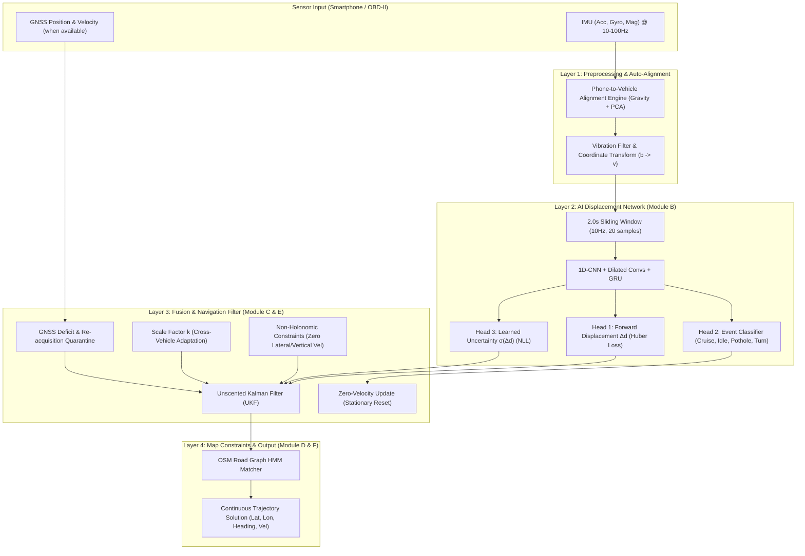

# 🧭 iNAV: AI-ML Intelligent Dead Reckoning System

**iNAV** is an Intelligent Dead Reckoning (IDR) navigation engine designed for smartphone sensors during GNSS-denied environments (tunnels, underground parking, dense urban canyons, and forests). It fuses deep-learning displacement prediction, kinematic constraints (NHC, ZUPT), Unscented Kalman Filtering (UKF), and OpenStreetMap (OSM) Hidden Markov Model (HMM) map-matching to achieve < 10% drift without external GNSS fixes.

---

## 🏗️ System Architecture



---

## 📁 Directory Structure

```
iNAV/
├── config.py              # Central config: dataset paths, column mappings, unit conversions, splits
├── requirements.txt       # Python dependencies
├── README.md              # Project documentation
├── data/
│   ├── ingest.py          # IO-VNBD dataset parser, cleaner, and Parquet converter
│   ├── sync.py            # Phone ↔ CAN cross-correlation time-alignment & 10Hz resampling
│   └── windowize.py       # Sliding window feature extractor & train/val/test splits
├── eval/
│   ├── outage_sim.py      # GNSS blackout simulator (10, 30, 60, 120, 180s)
│   ├── replay.py          # Trajectory replay engine (runs IMU through models/filters)
│   ├── score.py           # Benchmark metrics: ATE, drift %, CEP50/95, cross/along-track
│   └── baseline.py        # Strapdown double-integration & constant velocity baselines
├── modules/
│   ├── alignment.py       # Phone-to-vehicle alignment engine (static + dynamic)
│   ├── velocity_net.py    # 1D-CNN + GRU multi-head displacement & uncertainty network
│   ├── ukf.py             # Unscented Kalman Filter with NHC, ZUPT, and scale factor k
│   └── gnss_handler.py    # GNSS health check & smooth quarantine re-acquisition
├── viz/
│   ├── plot_trajectory.py # Trajectory plotting on Folium / Matplotlib
│   └── plot_sensors.py    # Raw sensor timeseries and noise analysis
├── models/                # Saved weights and ONNX models
└── results/               # Experiment logs and leaderboard.csv
```

---

## 🎯 Benchmark Targets

| Metric | ISRO / PS Target | iNAV Engineering Target |
|---|---|---|
| Dead Reckoning Drift | < 10% distance | **< 5% distance** |
| 50m Outage (< 1 min) | < 5m drift | **< 3.5m drift** |
| 1km Outage (@ 60 km/h) | < 100m drift | **< 60m drift** |
| Update Rate | 10 Hz | **10 Hz Filter, 60 fps UI** |

---

## 🚀 Quick Start: Testing the Final Model

To verify the final **VelocityNet** Dead Reckoning model on real-world driving trajectory data:

```bash
# 1. Install dependencies
pip install -r requirements.txt

# 2. Run instant benchmark on included synchronized Parquet trajectory
python test_final_model.py

# 3. Test on full 8-minute motorway trajectory with GNSS blackouts
python test_final_model.py --parquet data/sample_test_trajectory_motorway.parquet

# 4. Verify all core pillars and integration tests
python eval/test_5pillars.py
```
