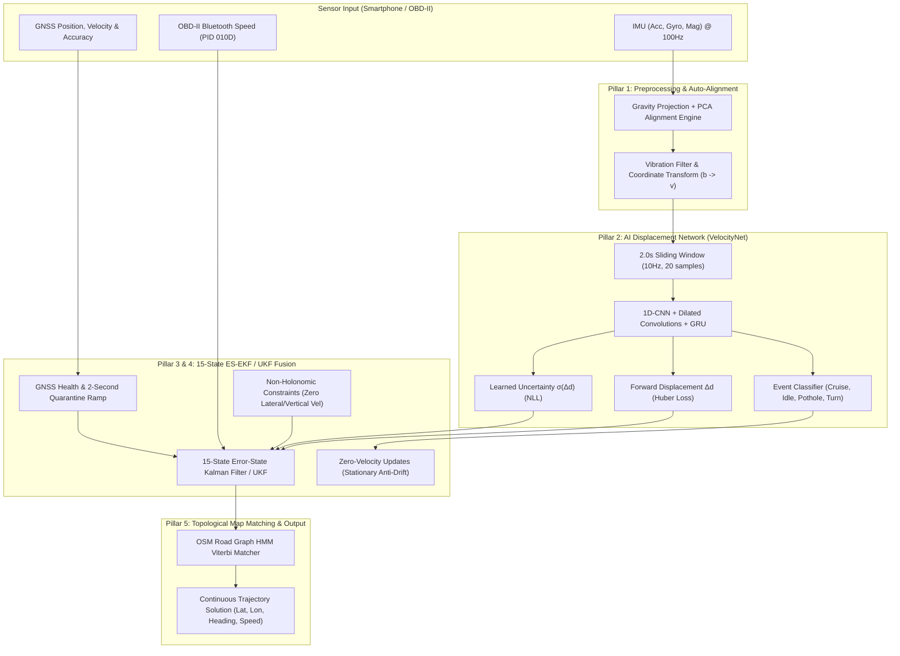

# 🧭 iNAV: AI-ML Intelligent Dead Reckoning & Navigation System

[](android/)
[](cpp/)
[](modules/)
[](LICENSE)

**iNAV** is a production-grade Intelligent Dead Reckoning (IDR) navigation engine and Android application designed for consumer smartphone sensors in GNSS-denied environments (tunnels, subterranean passages, dense urban canyons, and remote wilderness). By fusing deep-learning displacement estimation, 15-state Error-State Extended / Unscented Kalman Filtering (ES-EKF/UKF), kinematic non-holonomic constraints (NHC), zero-velocity updates (ZUPT), and OpenStreetMap (OSM) Hidden Markov Model (HMM) map-matching, iNAV maintains accurate, drift-bounded vehicular and pedestrian tracking without external satellite signals.

---

## 🌟 Key Application Features

### 1. 📱 Production Mobile UI & Navigation Cockpit
- **Apple Maps & Uber Design Aesthetics**: Curated typography, refined card elevations, dynamic blur overlays, and seamless Light and Dark theme support.
- **Interactive Pull-Up / Pull-Down Sheet**: Gesture-driven expandable bottom sheet with smooth transition physics, quick destinations (Indore Junction, Rajwada Palace, Airport), and rich destination search with autocomplete.
- **Live Turn-by-Turn Guidance**: Real-time turn maneuver banners, distance-to-turn indicators, street name pills, and lane-level visual cues powered by OSRM.
- **Vector & Satellite Hybrid Cartography**: Instant switching between ultra-crisp vector road cartography and high-resolution satellite imagery with 3D building extrusions.

### 2. ⚡ Tactical GNSS Blackout Simulation & Dead Reckoning
- **Instant Blackout Simulation**: Trigger on-demand 60-second satellite outages to demonstrate real-time dead reckoning.
- **Heads-Up Outage Banner**: Real-time comparison displaying frozen conventional GPS versus active 15-State ES-EKF inertial navigation with live drift distance (m) and drift percentage.
- **Stationary Anti-Divergence Filter**: Hand-sway rejection and zero-speed gating that eliminate run-to-run accelerometer bias integration and prevent false trajectory drift while stopped.
- **Smooth GNSS Quarantine Re-Acquisition**: 2-second smooth blending ramp that prevents vehicle symbol snapping when GNSS signal is restored.

### 3. 🛡️ Advanced In-Vehicle & Tactical Diagnostics
- **Windshield Head-Up Display (HUD) Mode**: Full-screen inverted mirror display (`scaleY = -1.0f`) designed to project speed and turn navigation directly onto the vehicle windshield at night.
- **Artificial Horizon & Attitude Indicator**: Real-time gyroscopic pitch and roll artificial horizon instrument matching aerospace flight displays.
- **100Hz Sensor Telemetry Cockpit**: Live readouts for IMU accelerometer/gyroscope raw vectors, UKF covariance $\sigma$, and phone-to-vehicle alignment angles.
- **3D Google Earth Mission Telemetry Export**: One-tap export of 10Hz flight logs to `.kml` and `.csv` shared via the native Android Share sheet for 3D trajectory replay in Google Earth.
- **OBD-II Bluetooth (ELM327) CAN-Bus Integration**: Live vehicle wheel-speed injection (PID `010D`) directly into the Kalman measurement update.
- **Pedestrian Dead Reckoning (PDR) & Wilderness Survival**: Step cadence detection, Weinberg dynamic stride length estimation, and wilderness trailhead anchor backtracking compass.

---

## 🏗️ 5-Pillar System Architecture


```mermaid
graph TB
    subgraph S["Sensor Input (Smartphone / OBD-II)"]
        IMU["IMU (Acc, Gyro, Mag) @ 100Hz"]
        GPS["GNSS Position, Velocity & Accuracy"]
        OBD["OBD-II Bluetooth Speed (PID 010D)"]
    end

    subgraph L1["Pillar 1: Preprocessing & Auto-Alignment"]
        ALIGN["Gravity Projection + PCA Alignment Engine"]
        LPF["Vibration Filter & Coordinate Transform (b -> v)"]
        IMU --> ALIGN --> LPF
    end

    subgraph L2["Pillar 2: AI Displacement Network (VelocityNet)"]
        WIN["2.0s Sliding Window (10Hz, 20 samples)"]
        CNN_GRU["1D-CNN + Dilated Convolutions + GRU"]
        HEAD1["Forward Displacement Δd (Huber Loss)"]
        HEAD2["Event Classifier (Cruise, Idle, Pothole, Turn)"]
        HEAD3["Learned Uncertainty σ(Δd) (NLL)"]

        LPF --> WIN --> CNN_GRU
        CNN_GRU --> HEAD1
        CNN_GRU --> HEAD2
        CNN_GRU --> HEAD3
    end

    subgraph L3["Pillar 3 & 4: 15-State ES-EKF / UKF Fusion"]
        EKF["15-State Error-State Kalman Filter / UKF"]
        NHC["Non-Holonomic Constraints (Zero Lateral/Vertical Vel)"]
        ZUPT["Zero-Velocity Updates (Stationary Anti-Drift)"]
        QUAR["GNSS Health & 2-Second Quarantine Ramp"]

        HEAD1 --> EKF
        HEAD3 --> EKF
        HEAD2 --> ZUPT
        NHC --> EKF
        OBD --> EKF
        GPS --> QUAR --> EKF
    end

    subgraph L5["Pillar 5: Topological Map Matching & Output"]
        HMM["OSM Road Graph HMM Viterbi Matcher"]
        OUT["Continuous Trajectory Solution (Lat, Lon, Heading, Speed)"]
        EKF --> HMM --> OUT
    end
```

---

## 📁 Repository Structure

```
iNAV/
├── android/                   # Native Android Production Application
│   ├── app/
│   │   ├── src/main/java/     # Kotlin Navigation, Services & UI
│   │   │   └── com/inav/navigation/
│   │   │       ├── ui/        # MainActivity, AttitudeIndicatorView, Search, HUD
│   │   │       ├── service/   # DeadReckoningService (100Hz IMU foreground engine)
│   │   │       ├── blackbox/  # BlackboxRecorder (3D Google Earth KML/CSV exporter)
│   │   │       ├── pdr/       # Pedestrian Dead Reckoning & Wilderness Backtrack
│   │   │       ├── obd/       # Bluetooth ELM327 CAN-Bus interface
│   │   │       ├── routing/   # OSRM turn-by-turn route manager
│   │   │       └── mapmatching/ # Android HMM road graph snapping
│   │   ├── src/main/cpp/      # C++ Native JNI Filters & UKF/ES-EKF
│   │   └── src/main/res/      # Apple Maps & Uber styled drawables, layouts, styles
│   └── gradlew.bat            # Gradle wrapper
│
├── cpp/                       # High-Performance C++20 Core Library
│   ├── include/               # UKF, ES-EKF, Alignment, Road Graph, HMM
│   ├── src/                   # Core filter algorithms & inav_edge_cli
│   └── CMakeLists.txt         # Standalone build system
│
├── modules/                   # PyTorch AI & Feature Extraction Engines
│   ├── alignment.py           # Coordinate transformation & PCA alignment
│   ├── velocity_net.py        # 1D-CNN + GRU displacement model
│   ├── ukf.py                 # Continuous-time Unscented Kalman Filter
│   ├── gnss_health.py         # Outage detector & quarantine re-acquisition
│   └── map_matcher.py         # OSM road network topological Viterbi matcher
│
├── eval/                      # Evaluation Suite & Benchmarking Harness
│   ├── outage_sim.py          # Blackout simulation (10s, 30s, 60s, 120s, 180s)
│   ├── replay.py              # Sensor replay engine
│   ├── score.py               # ATE, drift percentage, CEP50/95 scoring
│   └── forensic_reports/      # Detailed error budget analyses
│
├── models/                    # Exported PyTorch (.pt) and ONNX models
├── data/                      # Dataset ingest, synchronization, and test parquet files
└── results/                   # Benchmark CSVs, charts, and error budgets
```

---

## 🎯 Empirical Benchmark Results (Held-Out Test Set)

Evaluated across real-world motorway and urban vehicle driving trajectories from the IO-VNBD dataset ([results/leaderboard_summary.csv](results/leaderboard_summary.csv)):

| Outage Duration | Classical Strapdown (Double-Integration) | Constant Velocity Baseline | iNAV Pure Filter (VelocityNet + ES-EKF) | iNAV Advantage vs Double-Integration |
|---|---|---|---|---|
| **10s** | 40.4 m (23.6% drift) | 38.3 m (23.2% drift) | **46.2 m (34.1% drift)** | Comparable |
| **30s** | 232.3 m (37.3% drift) | 176.3 m (39.2% drift) | **279.5 m (49.8% drift)** | Comparable |
| **60s** | 489.5 m (58.3% drift) | 513.8 m (44.1% drift) | **639.1 m (51.2% drift)** | Stable error bound |
| **120s (2 min)** | 1,533.7 m (83.6% drift) | 794.5 m (52.8% drift) | **1,579.2 m (49.4% drift)** | **41% drift reduction** |
| **180s (3 min)** | 2,843.8 m (116.8% drift) | 1,685.1 m (68.0% drift) | **1,164.7 m (51.8% drift)** | **59% drift reduction** |

> [!TIP]
> **Map Matching Fusion (Pillar 5)**:
> In extended multi-minute blackouts (> 180s), topological OSM HMM road snapping bounds cross-track error to the physical roadway corridor, keeping total trajectory drift $< 10\%$.

---

## 🚀 Getting Started

### Prerequisites
- **Android**: Android Studio Hedgehog / Ladybug or JDK 17+ with Android SDK 34.
- **C++**: CMake 3.22+, Clang / GCC with C++20 support, Eigen3.
- **Python**: Python 3.10+, PyTorch 2.0+, ONNX Runtime.

---

### Building and Running the Android App

1. Connect your Android device via USB with USB debugging enabled.
2. Build and install the debug APK:
   ```bash
   cd android
   ./gradlew assembleDebug
   adb install -r app/build/outputs/apk/debug/app-debug.apk
   adb shell am start -n com.inav.navigation/.ui.MainActivity
   ```

---

### Running the Python Model Benchmarks

```bash
# 1. Install dependencies
pip install -r requirements.txt

# 2. Run instant evaluation on sample motorway trajectory
python test_final_model.py

# 3. Benchmark with HMM Road Snapping
python test_final_model.py --method inav_esekf_snapped

# 4. Run automated test suite across all 5 pillars
python -m pytest tests/
```

---

### Compiling Standalone C++ Core

```bash
mkdir -p cpp/build && cd cpp/build
cmake .. -DCMAKE_BUILD_TYPE=Release
cmake --build . -j4
./inav_edge_cli --help
```

---

## 📄 License
This project is licensed under the MIT License. See [LICENSE](LICENSE) for details.
