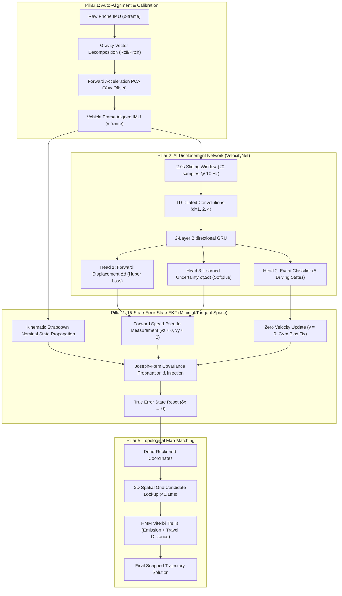

# 🧭 iNAV System Architecture Reference: Intelligent Vehicular Dead-Reckoning (IDR)

This document serves as the comprehensive, authoritative technical architecture reference and module contract specification for the **iNAV** dead-reckoning navigation system.

---

## 1. Executive Summary & Problem Scope

Modern smartphone navigation depends almost exclusively on Global Navigation Satellite Systems (GNSS: GPS, GLONASS, Galileo, NavIC). In GNSS-denied environments—such as motorway tunnels, underground parking garages, dense urban street canyons, dense canopy forests, or under active radio-frequency jamming/spoofing—standard GNSS receivers fail completely.

Classical inertial dead reckoning via strapdown double-integration of consumer MEMS accelerometers suffers from quadratic and cubic error growth:
$$\Delta p(t) \propto \iint (a_{\text{meas}} - b_a) \, dt^2$$
Within 30–60 seconds, consumer sensor biases ($b_a, b_\omega$) and gravity leakage cause position estimates to diverge into multi-hundred-meter errors.

**iNAV** solves this using an **AI-augmented multi-pillar navigation architecture**:
1. It replaces naive acceleration double-integration with a multi-task deep neural network (**VelocityNet**) that regresses forward displacement ($\Delta d$) and learned uncertainty directly from windowed multi-scale vibration features.
2. It fuses displacement pseudo-measurements with IMU strapdown kinematics inside a **15-State Tangent-Space Error-State Extended Kalman Filter (ES-EKF)**.
3. It bounds long-term trajectory drift using **2D Spatial Grid HMM Map Matching** against topological road networks.

---

## 2. Repository Structure & Directory Taxonomy

The repository is organized into five tightly coupled subsystems:

```
iNAV/
├── cpp/                           # High-performance C++17 native engine & edge libraries
│   ├── include/
│   │   ├── inav_filter.hpp        # 15-State ES-EKF kinematic dead reckoning engine
│   │   └── inav_onnx.hpp          # ONNX Runtime C++ mobile wrapper (clamped Softplus sigma)
│   ├── src/
│   │   ├── inav_filter.cpp        # Filter state propagation, ZUPT, and update equations
│   │   ├── inav_edge_cli.cpp      # Standalone edge binary execution harness
│   │   └── main.cpp               # Desktop verification entry point
│   └── CMakeLists.txt             # Cross-platform build script (supports -DANDROID=ON)
│
├── android/                       # Production Android application (Kotlin + NDK)
│   └── app/
│       ├── build.gradle           # NDK integration, OsmDroid 6.1.18, ONNX Runtime Mobile
│       └── src/main/
│           ├── cpp/               # Android NDK native JNI bridge
│           │   ├── inav_jni.cpp   # JNI bridge exposing C++ filter to Kotlin
│           │   ├── inav_filter.hpp
│           │   └── inav_onnx.hpp
│           ├── java/com/inav/navigation/
│           │   ├── service/       # Foreground DeadReckoningService & sensor listener
│           │   ├── mapmatching/   # RoadNetworkManager (OSM Overpass) & RoadSnapper
│           │   └── ui/            # MainActivity, Google Maps Cockpit UI, FastOSM
│           └── assets/
│               ├── velocity_net.onnx    # Quantized ONNX model for on-device inference
│               └── osm_roads_cache.json # Offline vector road segments (Indore test corridor)
│
├── modules/                       # Python algorithmic reference & research implementations
│   ├── velocity_net.py            # VelocityNet PyTorch multi-task neural network architecture
│   ├── esekf.py                   # 15-State Minimal Tangent-Space Error-State EKF (Joseph form)
│   ├── ukf.py                     # 7-State Unscented Kalman Filter baseline
│   ├── alignment.py               # Phone-to-vehicle coordinate alignment (static + dynamic PCA)
│   ├── map_matcher.py             # 2D Spatial Grid & HMM Viterbi road network matcher
│   ├── gnss_handler.py            # GNSS deficit mode manager & smooth quarantine re-acquisition
│   ├── augmentation.py            # 3D spatial SO(3) rotation augmentation algorithms
│   └── mtn.py                     # Motion Transformation Network for decoupled attitude
│
├── data/                          # IO-VNBD dataset pipeline & test fixtures
│   ├── ingest.py                  # Parser, unit normalizer, and column schema standardizer
│   ├── sync.py                    # Cross-correlation timestamp aligner & 10 Hz resampler
│   ├── windowize.py               # 2.0s window extraction & 41-group drive split generator
│   ├── sample_test_trajectory.parquet          # Lightweight verification drive (180 KB)
│   └── sample_test_trajectory_motorway.parquet # Full 8-minute motorway test drive (1.19 MB)
│
├── eval/                          # Benchmarking, replay, and scoring harnesses
│   ├── replay.py                  # End-to-end trajectory replay with synthetic blackouts
│   ├── outage_sim.py              # Blackout generator (10s, 30s, 60s, 120s, 180s)
│   ├── score.py                   # ATE, drift percentage, CEP50/95, cross/along-track metrics
│   ├── baseline.py                # Pure strapdown and constant-velocity benchmark baselines
│   └── test_5pillars.py           # Comprehensive automated unit & integration test suite
│
├── models/                        # Saved neural network checkpoints & exported models
│   ├── velocity_net_best.pt       # PyTorch trained model checkpoint (810 KB)
│   └── velocity_net.onnx          # Standalone ONNX model for edge and mobile execution
│
├── results/                       # Empirical leaderboard and benchmark summary data
│   ├── leaderboard.csv            # Instance-by-instance blackout replay evaluation
│   └── leaderboard_summary.csv    # Aggregated metrics across all outage durations
│
├── config.py                      # Central repository configuration (constants, paths, schema)
├── test_final_model.py            # Standalone 1-command verification harness
├── train.py                       # Training script with multi-task loss and cosine annealing
└── export_onnx.py                 # PyTorch to ONNX model export and validation script
```

---

## 3. The 5 Core Algorithmic Pillars



### Pillar 1: Phone-to-Vehicle Dynamic Auto-Alignment ([modules/alignment.py](file:///c:/Projects/SIH%202026/iNAV/modules/alignment.py))
Users place smartphones arbitrarily in vehicles (dashboard mounts, cup holders, pockets). iNAV executes a dual-phase calibration:
* **Static Phase**: When stationary ($||\mathbf{a}|| \approx g$), the gravity vector defines the vertical axis ($\mathbf{u}_{z,v} = -\mathbf{a} / ||\mathbf{a}||$), resolving vehicle Pitch and Roll.
* **Dynamic Phase**: During initial vehicle acceleration, Principal Component Analysis (PCA) on horizontal acceleration isolates the dominant longitudinal axis ($\mathbf{u}_{x,v}$), resolving the Yaw orientation offset without relying on compass sensors vulnerable to cabin magnetic anomalies.

### Pillar 2: VelocityNet Multi-Task Neural Network ([modules/velocity_net.py](file:///c:/Projects/SIH%202026/iNAV/modules/velocity_net.py))
* **Multi-Scale Convolution**: 1D Dilated Convolutions ($k=3$, dilation factors $1, 2, 4$) capture high-frequency engine/wheel vibration patterns and road texture without temporal downsampling.
* **Temporal Sequence Modeling**: 2-layer Bidirectional GRU (hidden dimension 64) models transient vehicle acceleration and deceleration dynamics.
* **Multi-Task Heads**:
  1. *Forward Displacement ($\Delta d$)*: Huber loss ($\beta=1.0$) provides quadratic loss for small errors and linear loss for large deviations.
  2. *Event Classification*: Cross-entropy loss over 5 driving states: `Stationary`, `Cruise`, `Hard Braking`, `Turning`, `Rough Road`.
  3. *Learned Uncertainty ($\sigma$)*: Gaussian Negative Log-Likelihood (NLL) with Softplus activation ensures strictly positive standard deviation ($\sigma > 0$), dynamically weighting filter innovation covariance.

### Pillar 3: Decoupled Motion Transformation ([modules/mtn.py](file:///c:/Projects/SIH%202026/iNAV/modules/mtn.py))
Decouples vehicle frame orientation estimation from forward speed regression, preventing coordinate rotation errors from contaminating displacement integration.

### Pillar 4: 15-State Minimal Tangent-Space ES-EKF ([modules/esekf.py](file:///c:/Projects/SIH%202026/iNAV/modules/esekf.py), [cpp/src/inav_filter.cpp](file:///c:/Projects/SIH%202026/iNAV/cpp/src/inav_filter.cpp))
Rather than an additive Extended Kalman Filter which suffers from quaternion gimbal lock and singularities, iNAV implements an Error-State EKF:
* **Nominal State (16D)**: Position $\mathbf{p} \in \mathbb{R}^3$, Velocity $\mathbf{v} \in \mathbb{R}^3$, Unit Quaternion $\mathbf{q} \in \mathbb{H}$, Accelerometer Bias $\mathbf{b}_a \in \mathbb{R}^3$, Gyroscope Bias $\mathbf{b}_\omega \in \mathbb{R}^3$.
* **Minimal Error State (15D)**:
  $$\delta \mathbf{x} = [\delta \mathbf{p}, \delta \mathbf{v}, \delta \boldsymbol{\theta}, \delta \mathbf{b}_a, \delta \mathbf{b}_\omega]^T \in \mathbb{R}^{15}$$
  where attitude error $\delta \boldsymbol{\theta}$ resides in the minimal 3D Lie algebra tangent space ($\mathfrak{so}(3)$).
* **Joseph-Form Covariance Propagation**:
  $$\mathbf{P} \leftarrow (\mathbf{I} - \mathbf{K}\mathbf{H}) \mathbf{P} (\mathbf{I} - \mathbf{K}\mathbf{H})^T + \mathbf{K} \mathbf{R} \mathbf{K}^T$$
  guaranteeing symmetry and positive semi-definiteness even across thousands of filter iterations.
* **Chi-Square ($\chi^2$) NIS Gating**: Rejects outlier GPS fixes and multipath spikes.

### Pillar 5: 2D Spatial Grid & HMM Map Matching ([modules/map_matcher.py](file:///c:/Projects/SIH%202026/iNAV/modules/map_matcher.py))
* **Uniform Spatial Hash Grid**: Subdivides Cartesian space into 50m cells, providing $\mathcal{O}(1)$ candidate road segment lookup ($< 0.1\text{ ms}$).
* **Speed-Scaled Emission Probability**:
  $$P(z_t | s_i) \propto \exp\left(-\frac{d_{\perp}^2}{2\sigma_d^2}\right) \cdot \exp\left(-\frac{\Delta \psi^2}{2\sigma_\psi^2}\right)$$
  where heading weighting scales dynamically from crawl speeds to motorway speeds.
* **Travel Distance Transition Probability**: Enforces topological continuity based on physical distance traveled ($\Delta s = \int v \, dt$), eliminating false jumps across overpasses and parallel access roads.

---

## 4. Hardware Edge & Mobile Execution Contracts

### Sensor Inputs
| Sensor | Android API | Frequency | Role |
|---|---|---|---|
| 3-Axis Accelerometer | `TYPE_ACCELEROMETER` / `LINEAR_ACCEL` | 50–100 Hz | High-rate kinematics & vibration features |
| 3-Axis Gyroscope | `TYPE_GYROSCOPE` | 50–100 Hz | Angular rates, attitude integration |
| 3-Axis Magnetometer / Game Vector | `TYPE_MAGNETIC_FIELD` / `GAME_ROTATION_VECTOR` | 50 Hz | Cardinal orientation tracking & compass fusion |
| Barometer | `TYPE_PRESSURE` | 10–20 Hz | Barometric altitude & vertical road grade |
| GNSS Location | `LocationManager.GPS_PROVIDER` | 1 Hz | Anchor updates, initial alignment, course-over-ground |

### C++ Native Interface Contract ([cpp/include/inav_filter.hpp](file:///c:/Projects/SIH%202026/iNAV/cpp/include/inav_filter.hpp))
* `void update_imu(double t, double ax, double ay, double az, double gx, double gy, double gz)`: Propagates nominal state and error covariance at IMU rate.
* `void update_velocity(double speed_fwd, double sigma)`: Fuses VelocityNet displacement pseudo-measurements and Non-Holonomic Constraints (NHC: $v_y \approx 0, v_z \approx 0$).
* `void update_gnss(double t, double lat, double lon, double alt, double speed, double heading, double accuracy)`: Fuses satellite fixes with gate validation.
* `NavState get_state()`: Returns Cartesian position, orientation quaternion, forward speed, and $1\sigma$ uncertainty envelope.

---

## 5. GNSS Deficit Handling & Re-acquisition Quarantine ([modules/gnss_handler.py](file:///c:/Projects/SIH%202026/iNAV/modules/gnss_handler.py))

* **Operating Modes**:
  * `AIDED`: Healthy GNSS ($> 5$ satellites, $\text{HDOP} < 2.5$) continuously anchors the filter.
  * `DEGRADED`: Degraded satellite geometry; measurement covariance $\mathbf{R}$ is inflated proportionally to HDOP.
  * `PURE_DR`: GNSS completely absent; system runs strictly on AI-inertial dead reckoning and topological road constraints.
* **Re-Acquisition Quarantine Protocol**:
  When GNSS returns after an extended blackout:
  1. The initial 3 consecutive fixes are quarantined in a buffer.
  2. Implied speed between consecutive fixes is validated ($v < 200\text{ km/h}$) to reject multipath transients.
  3. Once validated, GNSS measurement covariance is linearly ramped ($50\times \to 1\times$ over 2.0 seconds) to ensure smooth trajectory convergence without visual teleportation on the map.
