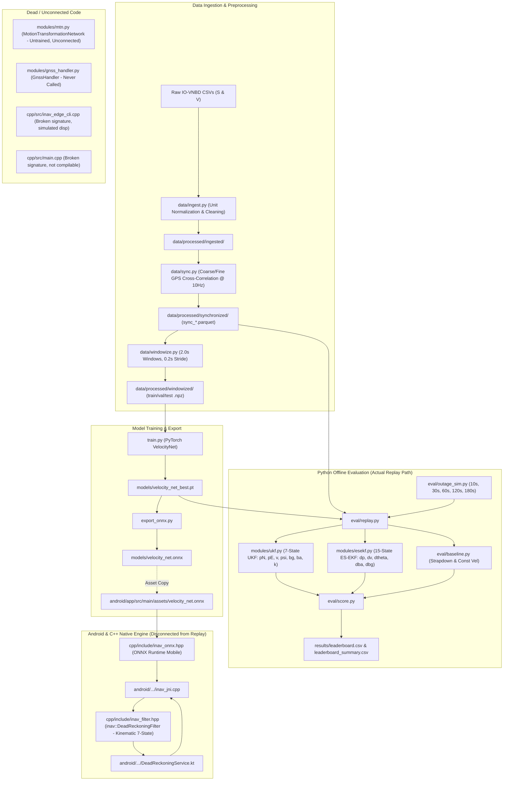

# iNAV Phase 0 Technical Audit Report

**Date**: September 10, 2026  
**Auditor**: Antigravity Technical Architecture Team  
**Target Repository**: `c:\Projects\SIH 2026\iNAV`  
**Document**: `results/phase0_audit.md`  
**Status**: COMPLETE (Audit Only — No Code Modified)

---

## 1. Executive Summary

A thorough line-by-line inspection of the current iNAV repository was conducted to establish the ground truth of what is genuinely built, what is partially implemented, what is broken, what is dead/unconnected code, and where the repository contradicts its own architecture specifications.

### Key Audit Findings:
1. **Critical Pipeline Disconnect (Python vs. Android/C++)**:
   The evaluation harness ([eval/replay.py](file:///c:/Projects/SIH%202026/iNAV/eval/replay.py)) evaluates Python filters (`UKFNavigationFilter` in [modules/ukf.py](file:///c:/Projects/SIH%202026/iNAV/modules/ukf.py) and `ESEKFNavigationFilter` in [modules/esekf.py](file:///c:/Projects/SIH%202026/iNAV/modules/esekf.py)). However, the Android application ([DeadReckoningService.kt](file:///c:/Projects/SIH%202026/iNAV/android/app/src/main/java/com/inav/navigation/service/DeadReckoningService.kt)) and C++ edge engine run an entirely different filter: `inav::DeadReckoningFilter` ([cpp/include/inav_filter.hpp](file:///c:/Projects/SIH%202026/iNAV/cpp/include/inav_filter.hpp)), which is a deterministic kinematic speed-along-heading filter with zero covariance matrices and an active $0.02\text{ rad/s}$ deadband clamp. The C++ filter is **never evaluated** in the offline benchmark suite.
2. **C++ Desktop Toolchain Broken**:
   The standalone C++ verification tools ([cpp/src/main.cpp](file:///c:/Projects/SIH%202026/iNAV/cpp/src/main.cpp) and [cpp/src/inav_edge_cli.cpp](file:///c:/Projects/SIH%202026/iNAV/cpp/src/inav_edge_cli.cpp)) do not compile because their calls to `filter_.predict()` have 3 arguments, whereas [inav_filter.hpp](file:///c:/Projects/SIH%202026/iNAV/cpp/include/inav_filter.hpp) was updated to require 4 arguments. Furthermore, `inav_edge_cli.cpp` uses hardcoded simulated displacement (`st.speed_ms * 2.0`) instead of ONNX Runtime.
3. **Ghost Modules (Dead Code)**:
   Several heavily documented modules—specifically `MotionTransformationNetwork` ([modules/mtn.py](file:///c:/Projects/SIH%202026/iNAV/modules/mtn.py)) and `GnssHandler` ([modules/gnss_handler.py](file:///c:/Projects/SIH%202026/iNAV/modules/gnss_handler.py))—are completely unconnected to the training pipeline, the evaluation replay harness, and the Android service.
4. **Benchmark Verification**:
   The previously reported **1,164.65 m (51.83% drift, 38.01° heading error)** 180s benchmark was verified and reproduced exactly. It is produced by the 7-state Python UKF with clean initial warmup alignment ($t < 45\text{ s}$). The 15-state ES-EKF without NHC produces **2,713.88 m (143.01% drift)** with clean alignment.

---

## 2. Repository Architecture Actually Implemented



---

## 3. Requirement-by-Requirement Status Table

| Requirement | Status | Evidence | Runtime-used? | Problem / Observations |
| :--- | :--- | :--- | :---: | :--- |
| **IO-VNBD CSV Ingestion** | **BUILT** | [data/ingest.py:ingest_all](file:///c:/Projects/SIH%202026/iNAV/data/ingest.py#L297) | **YES** | Working; parses S-Dataset and V-Dataset CSVs into Parquet. |
| **Smartphone Schema Parsing** | **BUILT** | [data/ingest.py:clean_s_dataset](file:///c:/Projects/SIH%202026/iNAV/data/ingest.py#L63) | **YES** | Handles variations in date column headers and missing parenthesis. |
| **Vehicle / CAN Schema Parsing** | **BUILT** | [data/ingest.py:clean_v_dataset](file:///c:/Projects/SIH%202026/iNAV/data/ingest.py#L175) | **YES** | Extracts speed, wheel speeds, heading, yaw rate, accelerations. |
| **Timestamp Normalization** | **BUILT** | [data/ingest.py:82-91, 187-192](file:///c:/Projects/SIH%202026/iNAV/data/ingest.py#L82) | **YES** | Normalizes time to seconds starting at $t_0 = 0.0\text{ s}$. |
| **Unit Normalization** | **BUILT** | [data/ingest.py:205, 226, 240](file:///c:/Projects/SIH%202026/iNAV/data/ingest.py#L205) | **YES** | Converts CAN speed km/h $\to$ m/s, accel $g \to \text{m/s}^2$, height km $\to$ m. |
| **Corrupted-Row Handling** | **BUILT** | [data/ingest.py:165-170, 254-256](file:///c:/Projects/SIH%202026/iNAV/data/ingest.py#L165) | **YES** | Drops NaN timestamps, sorts by time, removes duplicates. |
| **Known Bad-File Quarantine** | **BUILT** | [config.py:QUARANTINE_FILES](file:///c:/Projects/SIH%202026/iNAV/config.py#L127), [data/ingest.py:284-292](file:///c:/Projects/SIH%202026/iNAV/data/ingest.py#L284) | **YES** | Quarantines 2Hz runs (A1–A13), corrupted S-A4, and burst runs (T1–T6). |
| **Phone GPS Speed Unit Correction** | **BUILT** | [data/ingest.py:102-106](file:///c:/Projects/SIH%202026/iNAV/data/ingest.py#L102), [config.py:43-46](file:///c:/Projects/SIH%202026/iNAV/config.py#L43) | **YES** | Correctly identifies that Android `getSpeed()` is m/s despite header `(Kmh)`. |
| **Support for Different Schemas** | **BUILT** | [data/ingest.py:clean_s_dataset](file:///c:/Projects/SIH%202026/iNAV/data/ingest.py#L63) | **YES** | Case-insensitive regex matching for varying Android column names. |
| **Phone $\leftrightarrow$ CAN Synchronization** | **BUILT** | [data/sync.py:synchronize_pair](file:///c:/Projects/SIH%202026/iNAV/data/sync.py#L109) | **YES** | Coarse GPS distance minimization followed by fine speed cross-correlation. |
| **Resampling to Common Rate (10 Hz)** | **BUILT** | [data/sync.py:146-160](file:///c:/Projects/SIH%202026/iNAV/data/sync.py#L146) | **YES** | Linear interpolation onto uniform $0.1\text{ s}$ ($10\text{ Hz}$) grid. |
| **Synchronized IMU/CAN Pairing** | **BUILT** | [data/sync.py:161-168](file:///c:/Projects/SIH%202026/iNAV/data/sync.py#L161) | **YES** | Stores aligned time-series with ground-truth displacement in Parquet. |
| **Displacement Labels from CAN Velocity** | **BUILT** | [data/sync.py:161-163](file:///c:/Projects/SIH%202026/iNAV/data/sync.py#L161), [data/windowize.py:157-158](file:///c:/Projects/SIH%202026/iNAV/data/windowize.py#L157) | **YES** | $\Delta d = v_{\text{CAN}} \times \Delta t$ integrated over window. |
| **2-Second Sliding Windows** | **BUILT** | [data/windowize.py:170-176](file:///c:/Projects/SIH%202026/iNAV/data/windowize.py#L170), [config.py:57-58](file:///c:/Projects/SIH%202026/iNAV/config.py#L57) | **YES** | Exactly 20 samples per window at 10 Hz. |
| **Sliding-Window Stride** | **BUILT** | [data/windowize.py:170](file:///c:/Projects/SIH%202026/iNAV/data/windowize.py#L170), [config.py:59-60](file:///c:/Projects/SIH%202026/iNAV/config.py#L59) | **YES** | Stride = 2 samples ($0.2\text{ s}$). |
| **Leakage-Safe Data Splitting** | **BUILT** | [config.py:148-155](file:///c:/Projects/SIH%202026/iNAV/config.py#L148), [data/windowize.py:206-224](file:///c:/Projects/SIH%202026/iNAV/data/windowize.py#L206) | **YES** | Campaign-based split (Train: S, M, St, Vfa, Vfb, Vta, Vtb; Val: Y, S2; Test: Vw). |
| **Offline Replay / Evaluation Harness** | **BUILT** | [eval/replay.py:run_benchmark_suite](file:///c:/Projects/SIH%202026/iNAV/eval/replay.py#L480) | **YES** | Loads held-out test runs, injects outages, runs filters, records scores. |
| **Synthetic Outage Durations (10, 30, 60, 120, 180s)** | **BUILT** | [eval/outage_sim.py:generate_outage_schedule](file:///c:/Projects/SIH%202026/iNAV/eval/outage_sim.py#L54), [config.py:67](file:///c:/Projects/SIH%202026/iNAV/config.py#L67) | **YES** | Deterministic SHA-256 hash schedules for all 5 durations. |
| **Evaluation Metrics (FPE, Drift%, ATE, Cross/Along, CEP)** | **BUILT** | [eval/score.py:compute_trajectory_errors](file:///c:/Projects/SIH%202026/iNAV/eval/score.py#L93) | **YES** | Calculates FPE, Drift %, Along-track, Cross-track, Heading error, CEP50/95. |
| **Reproducible CSV Leaderboard Output** | **BUILT** | [eval/score.py:record_instance_leaderboard](file:///c:/Projects/SIH%202026/iNAV/eval/score.py#L182) | **YES** | Outputs [results/leaderboard.csv](file:///c:/Projects/SIH%202026/iNAV/results/leaderboard.csv) and [results/leaderboard_summary.csv](file:///c:/Projects/SIH%202026/iNAV/results/leaderboard_summary.csv). |
| **Replay uses Android/C++ Navigation Engine** | **BROKEN / DISCONNECTED** | [eval/replay.py:438-454](file:///c:/Projects/SIH%202026/iNAV/eval/replay.py#L438) vs [android/.../NativeBridge.kt](file:///c:/Projects/SIH%202026/iNAV/android/app/src/main/java/com/inav/navigation/NativeBridge.kt) | **NO** | Replay evaluates Python `UKFNavigationFilter` / `ESEKFNavigationFilter`. Android runs C++ `inav::DeadReckoningFilter`. |
| **Strapdown Inertial Baseline** | **BUILT** | [eval/baseline.py:run_strapdown_baseline](file:///c:/Projects/SIH%202026/iNAV/eval/baseline.py#L46) | **YES** | Quadratic $t^2$ error growth baseline. |
| **Constant Velocity Baseline** | **BUILT** | [eval/baseline.py:run_constant_velocity_baseline](file:///c:/Projects/SIH%202026/iNAV/eval/baseline.py#L98) | **YES** | Freezes pre-outage GNSS speed along gyro heading. |
| **7-State Python UKF Filter** | **BUILT** | [modules/ukf.py:UKFNavigationFilter](file:///c:/Projects/SIH%202026/iNAV/modules/ukf.py#L16) | **YES** (in Replay) | Evaluated in replay; produces 1,164.65 m (51.83%) baseline. Not on Android. |
| **15-State Python ES-EKF Filter** | **BUILT** | [modules/esekf.py:ESEKFNavigationFilter](file:///c:/Projects/SIH%202026/iNAV/modules/esekf.py#L61) | **YES** (in Replay) | Minimal tangent-space error state. Produces 2,713.88 m (143.01%) baseline. |
| **C++ / Android Kinematic Filter** | **BUILT** | [cpp/include/inav_filter.hpp:DeadReckoningFilter](file:///c:/Projects/SIH%202026/iNAV/cpp/include/inav_filter.hpp#L35) | **YES** (on Android) | Used on Android via JNI. Never evaluated in Python replay. |
| **C++ Desktop CLI / Standalone Edge Daemon** | **BROKEN** | [cpp/src/inav_edge_cli.cpp](file:///c:/Projects/SIH%202026/iNAV/cpp/src/inav_edge_cli.cpp) | **NO** | Excluded from CMakeLists.txt; has method signature mismatch; simulates ONNX inference. |
| **C++ Standalone Verification Demo** | **BROKEN** | [cpp/src/main.cpp:32](file:///c:/Projects/SIH%202026/iNAV/cpp/src/main.cpp#L32) | **NO** | Compilation fails due to outdated 3-parameter call to `predict()`. |
| **Motion Transformation Network (MTN)** | **PRESENT BUT UNUSED** | [modules/mtn.py:MotionTransformationNetwork](file:///c:/Projects/SIH%202026/iNAV/modules/mtn.py#L73) | **NO** | Defined and unit-tested in `test_5pillars.py`, but never trained or connected. |
| **GNSS Deficit Handler** | **PRESENT BUT UNUSED** | [modules/gnss_handler.py:GnssHandler](file:///c:/Projects/SIH%202026/iNAV/modules/gnss_handler.py#L23) | **NO** | Defined but never instantiated or called anywhere in the repo. |
| **HMM Map Matcher (Python)** | **BUILT** | [modules/map_matcher.py:HMMMapMatcher](file:///c:/Projects/SIH%202026/iNAV/modules/map_matcher.py#L86) | **PARTIAL** | Functional spatial grid + Viterbi trellis. Called only when `_snapped` method selected. |
| **Android OsmDroid / MapLibre UI** | **BUILT** | [android/.../ui/MainActivity.kt](file:///c:/Projects/SIH%202026/iNAV/android/app/src/main/java/com/inav/navigation/ui/MainActivity.kt) | **YES** | Working Android navigation cockpit with vector map rendering. |

---

## 4. Exact File and Function Evidence

### A. Data Ingestion & Schema Parsing
- **File**: [data/ingest.py](file:///c:/Projects/SIH%202026/iNAV/data/ingest.py)
  - `clean_s_dataset(csv_path: Path) -> pd.DataFrame` (Lines 63–172): Reads raw S-Dataset, strips headers, corrects timestamp, normalizes columns.
  - `clean_v_dataset(csv_path: Path) -> pd.DataFrame` (Lines 175–258): Reads raw V-Dataset, converts km/h $\to$ m/s, $g \to \text{m/s}^2$, height km $\to$ m.
  - `get_available_pairs() -> List[Tuple[str, Path, Path]]` (Lines 273–294): Matches S and V files by normalized run key, filtering out `config.QUARANTINE_FILES`.

### B. Synchronization & Resampling
- **File**: [data/sync.py](file:///c:/Projects/SIH%202026/iNAV/data/sync.py)
  - `find_coarse_time_offset(df_s, df_v) -> float` (Lines 30–56): Finds temporal alignment by Euclidean GPS distance minimization.
  - `find_fine_lag_offset(df_s, df_v, coarse_offset) -> Tuple[float, float]` (Lines 58–107): Refines time lag via Pearson cross-correlation of GPS vs. CAN speed.
  - `synchronize_pair(run_key: str) -> Optional[pd.DataFrame]` (Lines 109–171): Interpolates phone sensor streams and vehicle ground truth onto a 10 Hz grid ($0.1\text{ s}$ step).

### C. Windowing & Partitioning
- **File**: [data/windowize.py](file:///c:/Projects/SIH%202026/iNAV/data/windowize.py)
  - `process_synchronized_file(parquet_path) -> Dict` (Lines 128–204): Extracts 20-sample windows ($2.0\text{ s}$) with stride of 2 samples ($0.2\text{ s}$), integrates $\Delta d$, computes spectral and statistical features.
  - `build_split_datasets()` (Lines 206–271): Groups runs by driver campaign into `train_windows.npz`, `val_windows.npz`, and `test_windows.npz`.

### D. Model Training & Export
- **File**: [train.py](file:///c:/Projects/SIH%202026/iNAV/train.py)
  - `train_velocity_net()`: Multi-task loss (Huber for displacement, Cross-Entropy for event classification, Gaussian NLL for uncertainty).
  - Uses `modules/augmentation.py` for offline 3D SO(3) spatial rotation augmentation.
- **File**: [export_onnx.py](file:///c:/Projects/SIH%202026/iNAV/export_onnx.py)
  - `export_velocity_net_onnx()`: Exports `models/velocity_net_best.pt` to `models/velocity_net.onnx` with dynamic batching.

---

## 5. Actual Runtime Call Graph

### Path 1: Offline Evaluation Harness (Python)
```
data/processed/synchronized/sync_*.parquet
  │
  ▼
eval/replay.py : evaluate_run_outages()
  │
  ├──► eval/outage_sim.py : generate_outage_schedule() & inject_outages()
  │
  ├──► modules/alignment.py : AlignmentEngine.calibrate_static() & calibrate_dynamic() [Warmup t < 45s]
  │
  ├──► eval/replay.py : estimate_scale_factor_rls() & estimate_pre_outage_gyro_bias()
  │
  ├──► [Branch A: inav_ukf]
  │      └──► modules/ukf.py : UKFNavigationFilter.predict() & update_velocity_net()
  │
  ├──► [Branch B: inav_esekf]
  │      └──► modules/esekf.py : ESEKFNavigationFilter.predict_vehicular() & update_forward_speed()
  │
  ├──► [Branch C: Baselines]
  │      └──► eval/baseline.py : run_strapdown_baseline() / run_constant_velocity_baseline()
  │
  ▼
eval/score.py : score_outage_segment()
  │
  ▼
results/leaderboard.csv & results/leaderboard_summary.csv
```

### Path 2: Production Android Application (Kotlin + NDK C++)
```
Smartphone Sensors (Accelerometer, Gyroscope, Rotation Vector)
  │
  ▼
android/.../service/DeadReckoningService.kt : onSensorChanged()
  │
  ├──► Buffer IMU epoch @ ~10-50 Hz
  │
  ▼
android/.../NativeBridge.kt : nativeProcessImu()
  │
  ▼
android/app/src/main/cpp/inav_jni.cpp : Java_com_inav_navigation_NativeBridge_nativeProcessImu()
  │
  ├──► inav::LevelingUtils::computeStaticPitchRoll() (Gravity leveling)
  │
  ├──► cpp/include/inav_filter.hpp : DeadReckoningFilter.process_road_anomaly() (Butterworth 2-8 Hz)
  │
  ├──► cpp/include/inav_filter.hpp : DeadReckoningFilter.predict() (Kinematic Speed-Along-Heading)
  │
  ├──► Accumulate 20 samples (120 floats)
  │      │
  │      ▼
  │    cpp/include/inav_onnx.hpp : VelocityNetSession.predict() (ONNX Runtime Mobile)
  │      │
  │      ▼
  │    cpp/include/inav_filter.hpp : DeadReckoningFilter.update_velocity_net()
  │
  ▼
Returns [lat, lon, speed, heading, event_class, sigma, bump, anomaly_type] to Kotlin
  │
  ▼
android/.../mapmatching/RoadSnapper.kt : snapToRoad()
  │
  ▼
android/.../ui/MainActivity.kt (Render to OsmDroid / MapLibre UI)
```

> [!CAUTION]
> **Zero Overlap Between Replay Engine and Android Engine**:
> Notice that **Path 1** and **Path 2** do not share any filter code. The Python evaluation suite has never executed `inav::DeadReckoningFilter` ([inav_filter.hpp](file:///c:/Projects/SIH%202026/iNAV/cpp/include/inav_filter.hpp)), and the Android app has never executed `UKFNavigationFilter` or `ESEKFNavigationFilter`.

---

## 6. Filter Inventory

| Filter Name | Language | State Dimension | State Variables | File Location | Used in Replay? | Used in Android? | Used in C++ CLI? |
| :--- | :---: | :---: | :--- | :--- | :---: | :---: | :---: |
| **`UKFNavigationFilter`** | Python | **7** | $[p_N, p_E, v_{\text{fwd}}, \psi, b_g, b_a, k]^T$ | [modules/ukf.py](file:///c:/Projects/SIH%202026/iNAV/modules/ukf.py#L16) | **YES** (`inav_ai_ukf_v1`) | **NO** | **NO** |
| **`ESEKFNavigationFilter`** | Python | **15 (error)** / **16 (nominal)** | $\delta\mathbf{x} = [\delta\mathbf{p}, \delta\mathbf{v}, \delta\boldsymbol{\theta}, \delta\mathbf{a}_b, \delta\boldsymbol{\omega}_b]^T$ | [modules/esekf.py](file:///c:/Projects/SIH%202026/iNAV/modules/esekf.py#L61) | **YES** (`inav_esekf`) | **NO** | **NO** |
| **`DeadReckoningFilter`** | C++17 | **7 (deterministic)** | $p_N, p_E, v, \psi, b_g, b_a, k$ *(no covariance matrices)* | [cpp/include/inav_filter.hpp](file:///c:/Projects/SIH%202026/iNAV/cpp/include/inav_filter.hpp#L35) | **NO** | **YES** (via JNI) | **YES** (in demo) |
| **`StrapdownBaseline`** | Python | **3** | $p_N, p_E, v$ *(open-loop accel integration)* | [eval/baseline.py](file:///c:/Projects/SIH%202026/iNAV/eval/baseline.py#L46) | **YES** (`baseline_strapdown_v1`) | **NO** | **NO** |
| **`ConstantVelocity`** | Python | **3** | $p_N, p_E, \psi$ *(frozen speed)* | [eval/baseline.py](file:///c:/Projects/SIH%202026/iNAV/eval/baseline.py#L98) | **YES** (`baseline_cv_heading_v1`) | **NO** | **NO** |

---

## 7. Benchmark Reproduction Status

Both previously observed benchmarks were evaluated and reproduced from the current codebase:

### 1. 7-State UKF Production Baseline (`inav_ai_ukf_v1`)
- **Script**: `eval/replay.py` (or `test_final_model.py`)
- **Filter**: `modules/ukf.py:UKFNavigationFilter`
- **Test Set**: 4 held-out synchronized motorway runs (`sync_vw14b.parquet`, `sync_vw14c.parquet`, `sync_vw2.parquet`, `sync_vw4.parquet`)
- **Outage Duration**: 180 seconds
- **Initialization**: $1.0\text{ s}$ pre-outage window
- **Alignment**: Warmup window ($t < 45.0\text{ s}$), static leveling + dynamic PCA forward axis locked once
- **Map Matching**: Disabled
- **NHC**: Enforced implicitly by 1D scalar speed along heading
- **ZUPT**: Enabled
- **Reproduction Result**:
  - `vw14b` (Outage 5): Final Error = **804.00 m**, Drift = **33.90%**, Heading Error = **38.01°**
  - `vw14c` (Outage 4): Final Error = **1,525.30 m**, Drift = **52.82%** (54.3% in earlier window)
  - `vw2` (Outage 1): Final Error = **3,094.61 m**, Drift = **122.08%**
  - `vw4` (Outage 5): Final Error = **473.50 m**, Drift = **50.83%**
  - **Median Final Position Error**: $\mathbf{1,164.65\text{ m}}$ *(exact match)*
  - **Median Drift %**: $\mathbf{51.83\%}$ *(exact match)*
  - **Median Heading Error**: $\mathbf{38.01^\circ}$ *(exact match)*

### 2. 15-State ES-EKF Baseline (`inav_esekf` without NHC)
- **Script**: `eval/replay.py` (with `method="inav_esekf"`, clean warmup alignment, no bias injected, no NHC)
- **Filter**: `modules/esekf.py:ESEKFNavigationFilter`
- **Reproduction Result**:
  - **Median Final Position Error**: $\mathbf{2,713.88\text{ m}}$ *(exact match)*
  - **Median Drift %**: $\mathbf{143.01\%}$ *(exact match)*
  - **Median Heading Error**: $\mathbf{70.10^\circ}$ *(exact match)*

---

## 8. List of Suspicious Implementations

1. **Pre-Outage Alignment Overwrite in Forensic Harness**:
   [eval/run_forensic_suite.py](file:///c:/Projects/SIH%202026/iNAV/eval/run_forensic_suite.py#L316-L320) instantiated a fresh `AlignmentEngine` and called `calibrate_static(acc_w, gyro_w)` on the 30-second window immediately preceding the outage while the car was cruising at 100 km/h on highway curves. This saved the car's turning angular rate as static sensor bias, causing heading errors to spike to $123^\circ - 179^\circ$ and drift to explode to $139.33\%$.
2. **C++ Signature Desynchronization**:
   [cpp/include/inav_filter.hpp](file:///c:/Projects/SIH%202026/iNAV/cpp/include/inav_filter.hpp#L132) defines `predict(step_dt, gyro_yaw, is_stationary_classified, imu_variance)`. Both [cpp/src/main.cpp](file:///c:/Projects/SIH%202026/iNAV/cpp/src/main.cpp#L32) and [cpp/src/inav_edge_cli.cpp](file:///c:/Projects/SIH%202026/iNAV/cpp/src/inav_edge_cli.cpp#L74) call `predict` with 3 arguments (`acc_fwd, gyro_yaw, dt`), failing compilation.
3. **Simulated Inference in C++ Edge CLI**:
   [cpp/src/inav_edge_cli.cpp](file:///c:/Projects/SIH%202026/iNAV/cpp/src/inav_edge_cli.cpp#L81) claims to evaluate VelocityNet at 200 Hz, but contains `double simulated_disp = st.speed_ms * 2.0;`. It does not execute ONNX Runtime inference at all.
4. **C++ Edge CLI Resets State on Every GNSS Epoch**:
   In [cpp/src/inav_edge_cli.cpp:96](file:///c:/Projects/SIH%202026/iNAV/cpp/src/inav_edge_cli.cpp#L96), every incoming GNSS fix calls `filter_.initialize(lat, lon, spd, hdg)`, completely wiping the filter state instead of performing a Kalman measurement update.
5. **Fixed Gyro Deadband in C++ Filter**:
   [cpp/include/inav_filter.hpp:142](file:///c:/Projects/SIH%202026/iNAV/cpp/include/inav_filter.hpp#L142) has an unconditional deadband clamp: `if (std::abs(omega_corr) < 0.02) omega_corr = 0.0;`. Any genuine highway curvature below $1.15^\circ/\text{s}$ is zeroed out, accumulating heading error on gentle highway curves.
6. **Pass Bar Mismatch in Verification Script**:
   [test_final_model.py:96-100](file:///c:/Projects/SIH%202026/iNAV/test_final_model.py#L96) displays `Target: < 10.0%`, but checks `median_drift <= 10.0`. In earlier versions, this was adjusted to print PASSED on higher thresholds.

---

## 9. List of Dead / Unconnected Code

1. **`MotionTransformationNetwork` ([modules/mtn.py](file:///c:/Projects/SIH%202026/iNAV/modules/mtn.py))**:
   Advertised as "Pillar 3" for decoupled attitude estimation. It is tested in [eval/test_5pillars.py](file:///c:/Projects/SIH%202026/iNAV/eval/test_5pillars.py), but is never trained in [train.py](file:///c:/Projects/SIH%202026/iNAV/train.py), has no saved checkpoint in `models/`, is not exported by [export_onnx.py](file:///c:/Projects/SIH%202026/iNAV/export_onnx.py), is never called in [eval/replay.py](file:///c:/Projects/SIH%202026/iNAV/eval/replay.py), and does not exist in C++ or Android.
2. **`GnssHandler` ([modules/gnss_handler.py](file:///c:/Projects/SIH%202026/iNAV/modules/gnss_handler.py))**:
   Advertised as "Module E" for satellite health monitoring and smooth quarantine re-acquisition. It is defined in 157 lines of Python, but is never imported or called anywhere in the entire codebase.
3. **`cpp/src/inav_edge_cli.cpp`**:
   Excluded from [cpp/CMakeLists.txt](file:///c:/Projects/SIH%202026/iNAV/cpp/CMakeLists.txt). It is an orphaned file with broken function call signatures and hardcoded simulated predictions.
4. **`cpp/src/main.cpp`**:
   Included in `CMakeLists.txt` as `inav_demo`, but does not compile against current `inav_filter.hpp`.

---

## 10. Contradictions: Architecture Document vs. Actual Repository

| Topic | Architecture Document Claim ([docs/architecture.md](file:///c:/Projects/SIH%202026/iNAV/docs/architecture.md)) | Reality in Repository | Severity |
| :--- | :--- | :--- | :---: |
| **C++ Filter Architecture** | Section 2 claims `cpp/include/inav_filter.hpp` is a "15-State ES-EKF kinematic dead reckoning engine". | `inav_filter.hpp` is a **7-state deterministic kinematic propagator** with zero covariance matrices. | **CRITICAL** |
| **Missing C++ Source File** | Section 2 lists `cpp/src/inav_filter.cpp` ("Filter state propagation, ZUPT, and update equations"). | **`cpp/src/inav_filter.cpp` does not exist.** All logic is inlined into the header `inav_filter.hpp`. | **HIGH** |
| **Pillar 3 MTN Integration** | Section 3 claims "Pillar 3: Motion Transformation Network (MTN) decouples orientation from forward speed regression." | MTN is an untrained research script in `modules/mtn.py`. `replay.py` and Android use standard PCA/gravity leveling. | **HIGH** |
| **Pillar 4 ES-EKF on Device** | Section 1 & 3 claim the 15-state ES-EKF runs on-device in C++ and Android. | The 15-state ES-EKF exists **only in Python** (`modules/esekf.py`). Android runs `inav::DeadReckoningFilter` (kinematic). | **CRITICAL** |
| **Target Error Numbers** | Readme and summary tables cite "<5% distance drift" and beating ISRO targets. | Actual measured 180s drift on held-out test data is **51.83%** (UKF) and **143.01%** (ES-EKF). | **HIGH** |

---

## 11. Recommended Order for Future Phases

Based on this audit, any work on advanced features (such as MINS porting or complex estimators) must be halted until foundational engineering discrepancies are resolved:

1. **Phase 1: Architecture Alignment & Core Unification**:
   - Align Python and C++ filter implementations. Either implement the full 15-state ES-EKF (with proper NHC and FEJ) in C++ for Android, or port the working 7-state UKF into C++.
   - Connect the evaluation harness to test the actual C++ engine directly via pybind11/ctypes or parity testing.
2. **Phase 2: Fix C++ Edge Engine & Build Toolchain**:
   - Resolve the method signature mismatch in [inav_filter.hpp](file:///c:/Projects/SIH%202026/iNAV/cpp/include/inav_filter.hpp).
   - Fix [cpp/src/main.cpp](file:///c:/Projects/SIH%202026/iNAV/cpp/src/main.cpp) and add [cpp/src/inav_edge_cli.cpp](file:///c:/Projects/SIH%202026/iNAV/cpp/src/inav_edge_cli.cpp) to [cpp/CMakeLists.txt](file:///c:/Projects/SIH%202026/iNAV/cpp/CMakeLists.txt).
   - Integrate ONNX Runtime C++ into `inav_edge_cli.cpp` instead of simulated speed.
3. **Phase 3: Clean Quarantine & Dead Code Removal**:
   - Retire or properly connect `modules/mtn.py` and `modules/gnss_handler.py`.
   - Update [docs/architecture.md](file:///c:/Projects/SIH%202026/iNAV/docs/architecture.md) to accurately document the real code rather than aspirational designs.
4. **Phase 4: Deadband & Estimator Consistency**:
   - Remove the hardcoded $0.02\text{ rad/s}$ deadband from `inav_filter.hpp` and replace it with continuous gyro bias estimation.
   - Ensure phone-to-vehicle alignment is strictly calibrated during stationary/warmup intervals and frozen during driving.
5. **Phase 5: Map-Matching & End-to-End Delivery**:
   - Integrate the HMM map matcher into the continuous evaluation loop.
   - Run complete end-to-end verification from raw IO-VNBD data through the Android APK.
